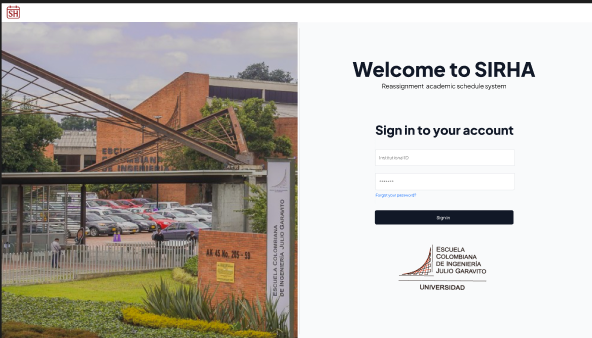
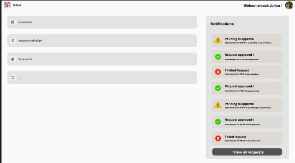
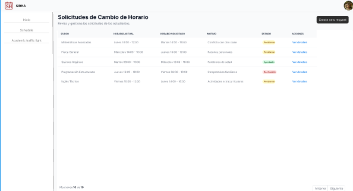

# 🌟 The Boys Frontend

Este proyecto corresponde al desarrollo de la interfaz gráfica del sistema **SIRHA**, donde se construye la experiencia de usuario enfocada en simplicidad, eficiencia y diseño moderno.

---

## 👥 Integrantes

- **Julian Camilo Lopez Barrero**  
- **Tulio Riaño Sanchez**  
- **Daniel Patiño Mejia**  
- **Nestor David Lopez Castañeda**  
- **Juan Sebastian Puentes Julio**  

---

## 📂 Repositorio

🔗 [The Boys Frontend](#)  

---

## 🎨 Mockups del proyecto

A continuación se presentan los mockups de las diferentes vistas del sistema.  

### 🧑‍🤝‍🧑 Vista de Usuarios  

🔗 https://www.figma.com/design/5FjLUpjz4JK90ODnYmOWz6/SIRHA?node-id=0-1&t=5uAXr3i0gTXRMYzx-1
 


---

### 📋 Vista de Gestión  


---

### ⚙️ Vista de Configuración  


---

### 📊 Vista de Reportes  


---

## 🚀 Cómo ejecutar el proyecto

1. Clonar el repositorio:
   ```bash
   git clone <url-del-repo>
