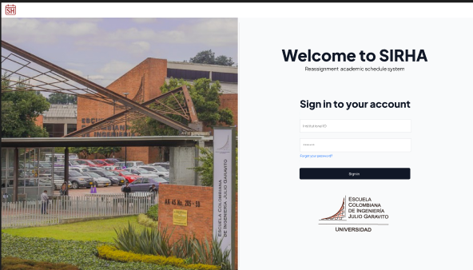
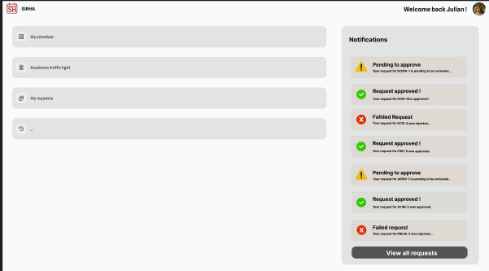
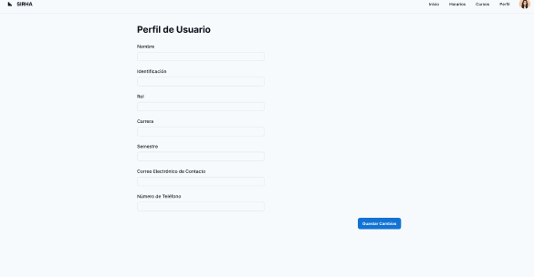
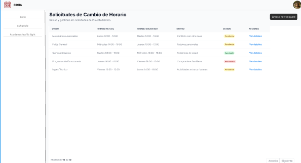

# 🌟 The Boys Frontend

Este proyecto corresponde al desarrollo de la interfaz gráfica del sistema **SIRHA**, donde se construye la experiencia de usuario enfocada en simplicidad, eficiencia y diseño moderno.

---

## 👥 Integrantes

- **Julian Camilo Lopez Barrero**
- **Tulio Riaño Sanchez**
- **Daniel Patiño Mejia**
- **Nestor David Lopez Castañeda**
- **Juan Sebastian Puentes Julio**

---

## 🌲Ramificacion y Estrategia de Versionamiento de ramas

- Se realiza la respectiva ramificacion creando las ramas `develop` y `feature` para desarrollar las nuevas funcionalidades de la aplicacion. Para los commits manejamos el estandar `feat/modulo: Accion Realizada` para que se entienda con claridad lo elaborado.

---

## 🎨 Mockups del proyecto

A continuación se presentan los mockups de las diferentes vistas del sistema.

### 🧑‍🤝‍🧑 Vista de Usuarios

🔗 https://www.figma.com/design/5FjLUpjz4JK90ODnYmOWz6/SIRHA?node-id=0-1&t=5uAXr3i0gTXRMYzx-1



---

### 📋 Vista de Gestión



---

### ⚙️ Vista de Configuración

## 

### 📊 Vista de Reportes



---

## 🚀 Cómo ejecutar el proyecto

1. Clonar el repositorio:
   ```bash
   git clone https://github.com/SIRHA-TheBoys/TheBoys-FrontEnd
   ```
2. Acceder al directorio del proyecto
   ```bash
   cd SIRHA-TheBoys/TheBoys-FrontEnd
   ```
3. Instalar todas las dependencias
   ```bash
   npm install
   ```
4. Iniciar el proyecto
   ```bash
   npm run dev
   ```